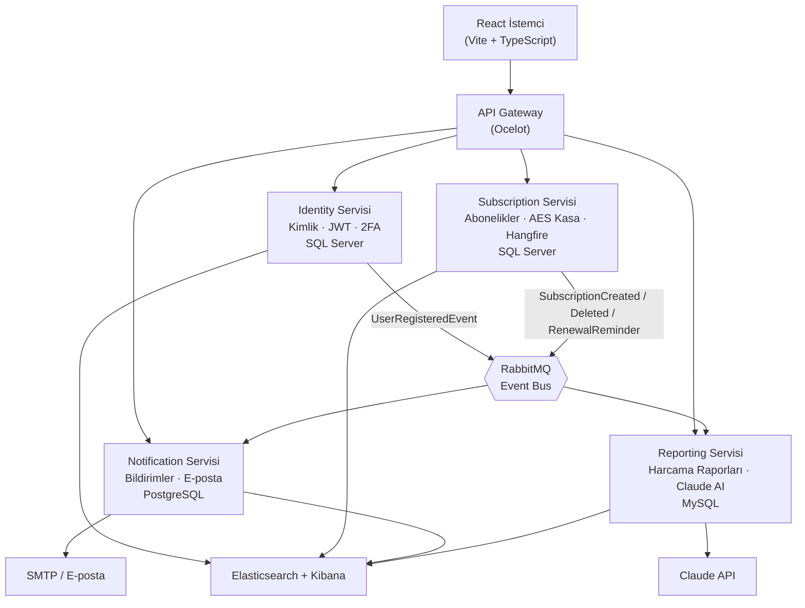

[English](./README.md) · **Türkçe**

# Milo

**Paranın nereye gittiğini gösteren, ödemeden önce seni uyaran mikroservis tabanlı abonelik takip sistemi.**

---

## Genel Bakış

**Milo**, herkesin yaşadığı bir sorunu çözer: onlarca abonelik — Netflix, Spotify, GitHub, AWS, ChatGPT — ve *"aya gerçekten ne kadar ödüyorum?"* sorusuna net bir cevap yok.

Milo tüm abonelikleri tek yerde toplar, harcama dağılımını grafiklerle gösterir, hesap bilgilerini güvenle saklar, yenileme hatırlatmaları gönderir (hem uygulama içi **hem de e-posta**) ve hatta **Claude API** kullanarak **yapay zeka destekli tasarruf önerileri** sunar.

**Dağıtık, olay tabanlı (event-driven) bir mikroservis sistemi** olarak kurulmuştur; **API Gateway**, üç farklı veritabanı, merkezi loglama, arka plan işleri ve modern bir React arayüzü içerir.

> *Bu projeye işlenen kişisel motto: **"Dünden daha iyi olmak."***

---

## Öne Çıkan Özellikler

- 🔐 **Kimlik Doğrulama & 2FA** — JWT tabanlı kimlik doğrulama ve Google Authenticator (TOTP) ile **iki faktörlü doğrulama**, QR kod kurulumu dahil.
- 💳 **Abonelik Takibi** — Platform, kategori, fiyat, periyot ve yenileme tarihleriyle tam CRUD.
- 🗝️ **Şifreli Hesap Kasası** — İsteğe bağlı hesap bilgisi saklama; şifreler **AES** ile şifrelenir ve yalnızca talep üzerine, sahiplik kontrolüyle çözülür.
- 📊 **Harcama Raporları** — Aylık toplam ve kategoriye göre dağılım, interaktif **pasta grafiklerle** görselleştirilir.
- ✨ **Yapay Zeka Tasarruf Önerileri** — Abonelik verilerini **Claude API**'ye gönderir, kişiselleştirilmiş Türkçe tasarruf önerileri döner.
- 📨 **Asenkron Mesajlaşma** — Servisler birbirini doğrudan çağırmaz; **RabbitMQ + MassTransit** üzerinden olay yayınlayıp dinler (`UserRegistered`, `SubscriptionCreated`, `SubscriptionDeleted`, `RenewalReminder`). Böylece servisler gevşek bağlı kalır ve biri çökse bile diğerleri çalışmaya devam eder.
- 🔔 **Yenileme Hatırlatmaları** — Her gün çalışan bir **Hangfire** arka plan işi yaklaşan yenilemeleri bulur, olay yayınlar ve hem uygulama içi bildirim hem de **gerçek e-posta** (MailKit/SMTP) üretir.
- ⏱️ **Otomatik Tarih İlerlemesi** — Geçmiş yenileme tarihleri periyoda göre (aylık/yıllık) otomatik olarak bir sonraki döneme kayar, veri asla bayatlamaz.
- 📈 **Genel Bakış (Dashboard)** — Özet ekran: aylık toplam, yaklaşan ödemeler ("3 gün", "Bugün" etiketleriyle), kategori grafiği ve son bildirimler.
- 🔎 **Merkezi Loglama** — Tüm servisler loglarını **Elasticsearch**'e gönderir, **Kibana** üzerinden izlenir.
- 🌐 **Polyglot Persistence** — Her servis kendi veritabanına sahiptir: **SQL Server**, **PostgreSQL** ve **MySQL**.

---

## Mimari

Milo, dört bağımsız mikroservisin önünde bir **API Gateway** ile çalışır. Servisler birbirleriyle **RabbitMQ üzerinden asenkron** (event-driven) haberleşir ve asla birbirlerinin veritabanına dokunmaz — her servis ihtiyaç duyduğu verinin kendi kopyasını tutar.

### Örnek Olay Akışları

- **Yeni abonelik:** `Subscription`, `SubscriptionCreatedEvent` yayınlar → `Reporting` raporlar için bir kopya saklar, `Notification` hoş geldin bildirimi oluşturur.
- **Silme tutarlılığı:** `Subscription`, `SubscriptionDeletedEvent` yayınlar → `Reporting` kendi kopyasını siler.
- **Yenileme hatırlatması:** Hangfire işi → `RenewalReminderEvent` → `Notification` uygulama içi bildirim yazar **ve** e-posta gönderir.
- **E-posta teslimi:** Kayıt sırasında `Identity`, `UserRegisteredEvent` yayınlar; `Notification` e-postayı kendi tarafında saklar, böylece Identity veritabanını hiç çağırmadan mail gönderebilir.

---

## Teknoloji Yığını

**Backend**
- ASP.NET Core 8 (Web API)
- Clean Architecture + CQRS/MediatR (Subscription servisi)
- Entity Framework Core
- MassTransit + RabbitMQ (event-driven mesajlaşma)
- Ocelot (API Gateway)
- ASP.NET Core Identity + JWT + TOTP 2FA
- Hangfire (zamanlanmış arka plan işleri)
- MailKit (SMTP e-posta)
- Serilog + Elasticsearch + Kibana (merkezi loglama)
- Claude API (yapay zeka önerileri)

**Veritabanları**
- SQL Server — Identity & Subscription
- PostgreSQL — Notification
- MySQL — Reporting

**Frontend**
- React 19 + Vite + TypeScript
- React Router
- Axios (JWT interceptor ile)
- Tailwind CSS
- Recharts (grafikler)
- lucide-react (ikonlar)

**Altyapı**
- Docker (SQL Server, PostgreSQL, MySQL, RabbitMQ, Elasticsearch, Kibana)
- Portainer (container yönetimi)

---

## Servisler

| Servis | Sorumluluk | Veritabanı | Öne Çıkanlar |
|---|---|---|---|
| **Identity** | Kayıt, giriş, JWT, 2FA | SQL Server | TOTP 2FA, `UserRegisteredEvent` yayınlar |
| **Subscription** | Abonelikler & şifreli kasa | SQL Server | Clean Architecture, CQRS, AES kasa, Hangfire işi |
| **Notification** | Uygulama içi bildirim & e-posta | PostgreSQL | Olayları dinler, SMTP mail gönderir |
| **Reporting** | Harcama raporları & AI önerileri | MySQL | Grafik verisi, Claude API entegrasyonu |
| **API Gateway** | Tek giriş noktası / yönlendirme | – | Ocelot |

---

## Ekran Görüntüleri

> _Ekran görüntüleri yakında eklenecek._

<!--
| Ana Sayfa | Genel Bakış |
|---|---|
|  |  |

| Raporlar & AI | Ayarlar / 2FA |
|---|---|
|  |  |
-->

---
## Lisans

Bu proje portfolyo ve öğrenme amacıyla geliştirilmiştir.

---

🐧 [**Aykut Adem**](https://github.com/AykutAdm) tarafından geliştirildi

